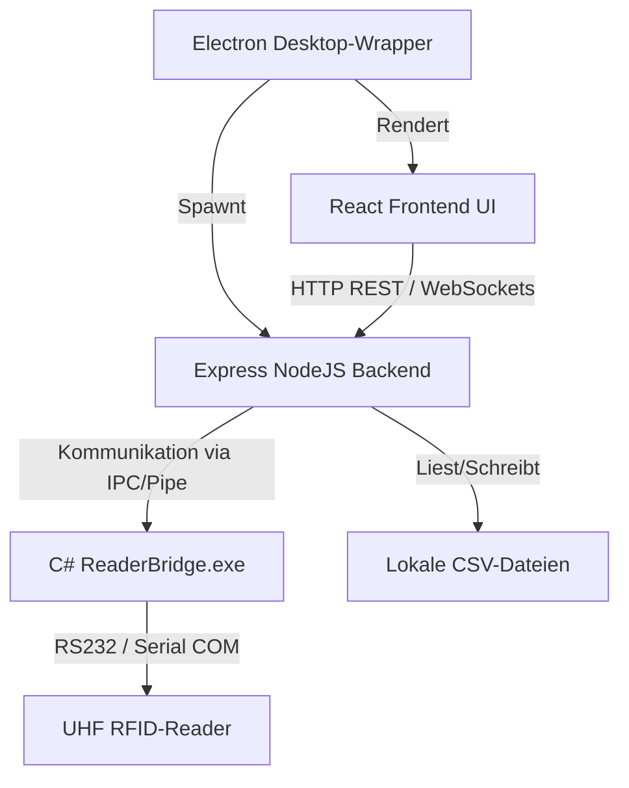

# AeroTrackTiming 🚴⏱️

AeroTrackTiming ist eine spezialisierte Offline-Desktop-Anwendung für die Zeitmessung von Radrennen und anderen Sportveranstaltungen. Sie vereint eine moderne Weboberfläche (React & Tailwind CSS) mit einem robusten Express-Backend und einer Electron-Desktop-Wrapper-Umgebung. Die Anwendung unterstützt sowohl manuelle Erfassungen als auch die automatisierte UHF RFID-Chipzeitmessung über eine integrierte serielle Schnittstelle.

---

## 🏗️ Systemarchitektur

Das System besteht aus vier Hauptkomponenten:



1. **Frontend (React, TypeScript, Vite, Tailwind CSS, Motion):** Eine interaktive Single-Page-App (SPA), die in Electron gerendert wird. Sie bietet reibungslose Übergänge, Echtzeit-Timing-Visualisierungen und intuitive Assistenten.
2. **Backend (Express, NodeJS):** Ein lokaler Webserver (standardmäßig auf Port 3000), der Dateiverwaltung (CSV-Datenhaltung), Berechnungen für Ranglisten und die Kommunikation mit der Hardware steuert.
3. **Hardware-Bridge (C# .NET Framework 4.7.2):** Die App `ReaderBridge.exe` stellt eine Brücke zwischen der C++ Hersteller-DLL (`ReaderService.dll`) und dem Node-Backend her. Sie liest RFID-Transponder-Daten und leitet sie im standardisierten JSON-Format an das Backend weiter.
4. **Datenhaltung (Lokale CSV-Dateien):** Alle Daten (Anmeldungen, Tag-Zuweisungen, Start- und Zielzeiten) werden offline in Excel-kompatiblen CSV-Dateien gespeichert. Es ist keine Internetverbindung oder Datenbankinstallation erforderlich.

---

## ✨ Features und Funktionen

### 1. 📂 Zentrale Ordnerverwaltung & Excel-Kompatibilität
* **Einstellbarer Speicherpfad:** Beim ersten Start wählt der Benutzer über einen nativen Windows-Ordnerauswahldialog den Speicherort für alle Projektdaten aus.
* **Optimiert für Microsoft Excel:** Alle generierten CSV-Dateien werden automatisch mit einem **UTF-8 BOM (Byte Order Mark)**, **CRLF-Zeilenumbrüchen** und **Semikolon-Trennung (`;`)** gespeichert. Dadurch können sie in Microsoft Excel per Doppelklick ohne Umlautfehler geöffnet und bearbeitet werden.
* **Automatische Daten-Migration:** Das System migriert veraltete Single-CSV-Strukturen automatisch in das moderne, ordnerbasierte Renn-Archiv.

### 2. 📝 Anmeldung (Registrierung)
* Manuelle Registrierung von Athleten (Vorname, Nachname, Jahrgang, Startnummer, Wohnort, Geschlecht, Vereinsstatus).
* Massenimport und -export von Anmeldungslisten als CSV.
* Automatische Validierung auf doppelte Startnummern.

### 3. 🏷️ Tag-Zuweisung (RFID-Zuordnung)
* Zuordnung von UHF RFID-Transpondern (EPC-Codes) zu Startnummern.
* Live-Scannen von Transpondern zur schnellen Zuweisung.
* Status-Verwaltung (`Locked`, `Invalid`) zur Absicherung gegen ungewollte Neuzuweisungen während des Events.

### 4. 🚀 Start-Methoden
AeroTrackTiming unterstützt zwei verschiedene Renn-Modi:
* **Einzelzeitfahren (StartZeitfahren):** 
  * Unterstützung konfigurierbarer Startintervalle (z.B. alle 30 oder 60 Sekunden).
  * Starterliste mit dynamischer Warteschlange.
  * Visueller und akustischer Countdown für die Athleten.
  * Manuelle und RFID-basierte Startzeit-Erfassung.
* **Massenstart:**
  * Synchroner Start einer Gruppe.
  * Integrierter Timer mit Startton.
  * Bulk-Erstellung aller Startzeiten auf die exakte Millisekunde.

### 5. 🏁 Ziel-Einlauf & Zeiterfassung (Ziel)
* Manuelle Zeiterfassung auf Tastendruck (z.B. Leertaste) für schnelles Stoppen ohne RFID-Hardware.
* Automatische RFID-Zielerfassung bei Verwendung eines angeschlossenen Readers.
* **Duplikatschutz:** Verhindert die Mehrfacherfassung desselben Teilnehmers im selben Rennen.

### 6. 🏆 Ranglisten & Auswertung (Rangliste)
* Berechnung der Fahrtzeit (`Zielzeit - Startzeit`) mit Millisekundengenauigkeit.
* Unterstützung für **Kategorien** auf Basis von Jahrgang (Alter), Geschlecht und Vereinszugehörigkeit (Club).
* **Kombinationswertung (Gesamtwertung):** Aggregation der Ergebnisse über mehrere ausgewählte Rennen hinweg (z.B. Mehr-Etappen-Rennen).
* **Geschwindigkeitsberechnung:** Automatische Berechnung der Durchschnittsgeschwindigkeit (km/h oder m/s) bei Angabe der Renndistanz.
* **Excel-Export mit Stil-Erhalt:** Nutzt `exceljs` und ein mitgeliefertes Template ([Rangliste_Vorlage.xlsx](file:///c:/Users/joelz/Dokumente/AeroTrackTiming/Rangliste_Vorlage.xlsx)), um die Formatierung (Schriftarten, Farben, Spaltenbreiten) direkt in die exportierten Ergebnisberichte zu übertragen.

---

## 🔌 Hardware-Integration (RFID UHF Reader)

Die Steuerung des RFID-Readers erfolgt über das Backend und den C#-Dienst `ReaderBridge.exe` im Unterordner `Reader/`.

### B04 Antennen-Steuerung (GPIO-Mapping)
Der Dienst unterstützt die Umschaltung von bis zu 4 Antennenanschlüssen an B04-Multiplexern:
* Antenne **1** ➡️ GPIO `72`
* Antenne **2** ➡️ GPIO `71`
* Antenne **3** ➡️ GPIO `73`
* Antenne **4** ➡️ GPIO `70`

*Hinweis: Wird die Antenne auf `0` gesetzt, überspringt das System die GPIO-Umschaltung und nutzt den aktuellen Standard-Port des Readers.*

### Serial-Parameter
* **Baudrate:** Standardmäßig `38400`
* **Parity / Bits:** None / 8 Data Bits / 1 Stop Bit
* **COM-Ports:** Werden über das Backend dynamisch per Windows PowerShell ermittelt.

---

## 📁 Datenstruktur (Dateimodell)

Im gewählten AeroTrackTiming-Speicherordner wird folgende Dateistruktur angelegt:

```text
AeroTrackTiming-Datenordner/
├── registrations.csv          # Datenbank aller angemeldeten Athleten
├── tags.csv                   # Verknüpfung von Startnummer ↔️ RFID EPC
├── races_metadata.json        # Distanzen und Zusatzinfos der Rennen
│
├── [Rennen_Name_1]/           # Ordner für ein spezifisches Rennen
│   ├── startzeiten.csv        # Startzeiten des Rennens 1
│   └── zielzeiten.csv         # Zielzeiten des Rennens 1
│
└── [Rennen_Name_2]/
    ├── startzeiten.csv        # Startzeiten des Rennens 2
    └── zielzeiten.csv         # Zielzeiten des Rennens 2
```

### CSV-Schemas

* **registrations.csv:** `vorname;name;geburtsdatum;startnummer;wohnort;gender;club`
  * *Hinweis: `geburtsdatum` speichert den Jahrgang (z.B. `1995`)*
* **tags.csv:** `startnummer;epc;timestamp;status`
* **startzeiten.csv / zielzeiten.csv:** `startnummer;vorname;nachname;jahrgang;startzeit;exactMs`

---

## 🛠️ Entwicklung und Installation

### Voraussetzungen
* [Node.js](https://nodejs.org/) (Version 18+ empfohlen)
* Windows OS (erforderlich für die RFID-Reader-Treiber und PowerShell-Ordnerauswahl)
* [Optional] .NET Framework 4.7.2 SDK (zum Kompilieren der `ReaderBridge.exe`)

### 1. Repository klonen und installieren
```powershell
git clone <repository-url> AeroTrackTiming
cd AeroTrackTiming
npm install
```

### 2. Umgebungsvariablen einrichten
Erstelle eine `.env.local` Datei im Hauptverzeichnis (du kannst die `.env.example` kopieren) und setze bei Bedarf deinen Gemini API-Key:
```env
GEMINI_API_KEY=dein_api_key_hier
```

### 3. Entwicklungsserver starten
Der folgende Befehl startet das NodeJS-Backend und öffnet die Electron-Desktop-App im Hot-Reload-Modus:
```powershell
npm run dev
```

### 4. RFID ReaderBridge kompilieren (C#)
Sollte die `ReaderBridge.exe` nicht vorhanden oder modifiziert worden sein, kann sie per PowerShell gebaut werden:
```powershell
dotnet build Reader\TagReaderCore\TagReader.Core.csproj -c Debug -p:Platform=x86
```

---

## 📦 Build & Release (Desktop App packen)

Um ein installationsfertiges Windows-Programm (`.exe` Installer) zu erstellen, verwende den Release-Build-Befehl:

```powershell
npm run dist
```

Dieser Befehl führt folgende Schritte aus:
1. Kompiliert das React-Frontend über Vite (`vite build`).
2. Bundelt das NodeJS-Backend über Esbuild in eine Single-File `dist/server.cjs`.
3. Verpackt die Electron-Shell, das Backend und alle notwendigen Assets (z.B. `Rangliste_Vorlage.xlsx` und `Reader/`) mithilfe von `electron-builder` in den Ausgabeordner `dist-desktop/`.

Der fertige Installer befindet sich anschließend unter `dist-desktop/AeroTrackTiming Setup <Version>.exe`.

---

## 🏆 Arbeitsablauf bei einem Rennen (Best Practice)

1. **Vorbereitung:**
   * Starte AeroTrackTiming und konfiguriere den Datenordner.
   * Importiere die Athletenliste über **Anmeldung** (oder trage sie manuell ein).
   * Gehe zu **Tag-Zuweisung** und weise jedem Athleten (Startnummer) einen RFID-Transponder zu.
2. **Hardware aufbauen:**
   * Verbinde den UHF RFID-Reader per USB/Serial mit dem Computer.
   * Wähle in der App-Sidebar den passenden **COM-Port** aus und klicke auf **Verbinden**.
3. **Start durchführen:**
   * Lege ein neues Rennen an.
   * Starte die Athleten entweder einzeln über **Start Zeitfahren** oder alle zusammen via **Massenstart**.
4. **Ziel-Zeitmessung:**
   * Öffne das **Ziel**-Tab und aktiviere das Monitoring für das aktuelle Rennen.
   * Sobald die Läufer die RFID-Antenne im Ziel passieren, wird ihre Zielzeit automatisch mit Millisekundengenauigkeit erfasst.
   * Fehlende oder beschädigte Chips können jederzeit über den manuellen Zeiterfassung-Button ausgeglichen werden.
5. **Auswertung:**
   * Wechsel zur **Rangliste**, wähle das Rennen aus und überprüfe die Ergebnisse.
   * Klicke auf **Excel Export**, um die formatierte Ergebnisliste zu speichern.
